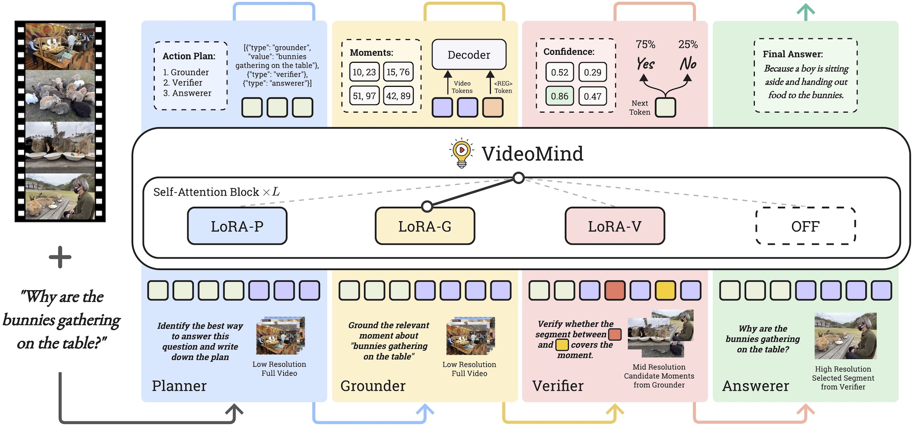

  

<h1 align="center">VideoMind: A Chain-of-LoRA Agent for Long Video Reasoning</h1>

  
  

  <a href="https://yeliu.dev/" target="_blank">Ye Liu</a>1&dagger;, <a href="https://qhlin.me/" target="_blank">Kevin Qinghong Lin</a>2&dagger;, <a href="https://web.comp.polyu.edu.hk/chencw/" target="_blank">Chang Wen Chen</a>1&#9993;, <a href="https://sites.google.com/view/showlab" target="_blank">Mike Zheng Shou</a>2&#9993;
  
1The Hong Kong Polytechnic University 2Show Lab, National University of Singapore

**VideoMind** is a multi-modal agent framework that enhances video reasoning by emulating *human-like* processes, such as *breaking down tasks*, *localizing* and *verifying* moments, and *synthesizing answers*. This approach addresses the unique challenges of temporal-grounded reasoning in a progressive strategy.

> [!NOTE]
> Our code, model, and training datasets will be released very soon. Stay tuned!
